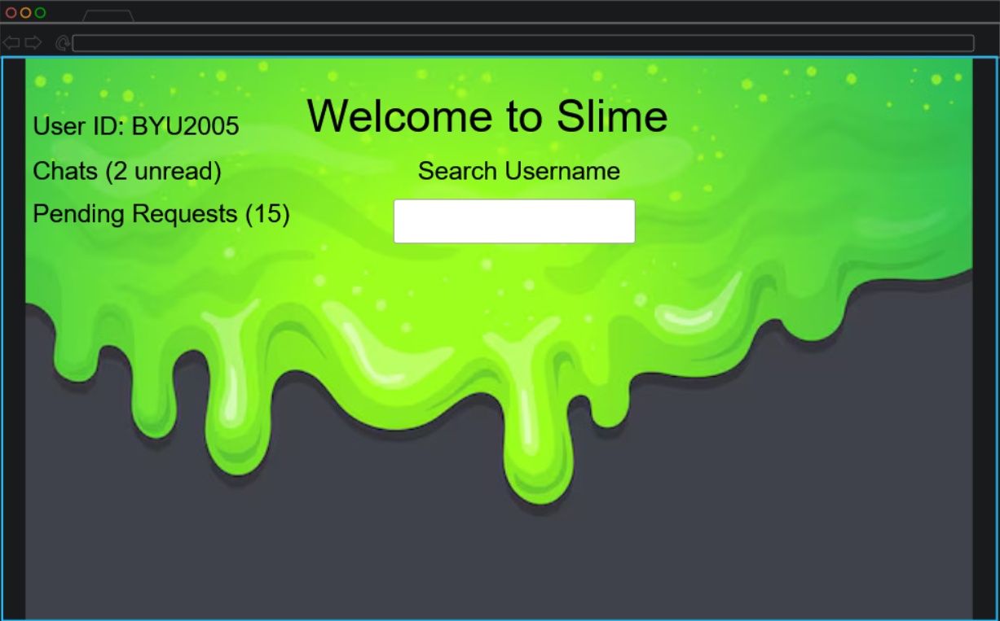
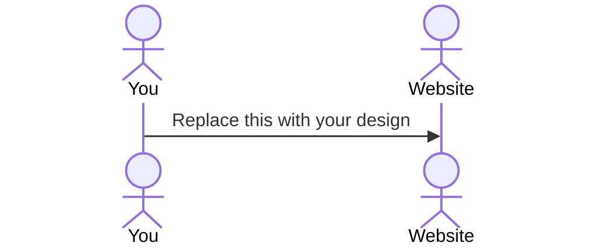

# Slime Webpage
[My Notes](notes.md) 

Slime is a website that allows you to communicate with your friends! It's free and is a lot of fun! You'll enjoy it just like I do! 
It's an app designed to allow you to chat with your friends!

> [!NOTE]
> This is a template for your startup application. You must modify this `README.md` file for each phase of your development. You only need to fill in the section for each deliverable when that deliverable is submitted in Canvas. Without completing the section for a deliverable, the TA will not know what to look for when grading your submission. Feel free to add additional information to each deliverable description, but make sure you at least have the list of rubric items and a description of what you did for each item.

> [!NOTE]
> If you are not familiar with Markdown then you should review the [documentation](https://docs.github.com/en/get-started/writing-on-github/getting-started-with-writing-and-formatting-on-github/basic-writing-and-formatting-syntax) before continuing.

## 🚀 Specification Deliverable

> [!NOTE]
> Fill in this sections as the submission artifact for this deliverable. You can refer to this [example](https://github.com/webprogramming260/startup-example/blob/main/README.md) for inspiration.

For this deliverable I did the following. I checked the box `[x]` and added a description for things I completed.

- [x] Proper use of Markdown
- [x] A concise and compelling elevator pitch  
- [x] Description of key features 
- [x] Description of how you will use each technology
- [x] One or more rough sketches of your application. Images must be embedded in this file using Markdown image references.
 
### Elevator pitch

Have you ever wanted a fun way to chat with your friends? That's what slime is all about it! You can text your friends using this fun and free site! No monthly fees, no payments neccessary to chat with your friends! Enjoy the neccesity of sending as many free messages as you would like!    

### Design

 

The design image features a nice slime background with a variety of text boxes displaying id, chats, pending friend requests, and an option to search usernames. Can't wait to see what comes from this idea!

### Key features

- Free messaging with friends 
- Add friends by their username
- You can post updates on your status 
- Accept friend requests
- Send as many messages for free

### Technologies

I am going to use the required technologies in the following ways.

- **HTML** - HTML will be used to create the user interface of the website, which will include a varierty of input tags, buttons, and images.
- **CSS** - CSS will be used to create the style for the webpage. It will make the webiste look visually appealing
- **React** - React will be used to make the website interactable for a user.
- **Service** - Backend services will be used to make sure that mesasges are properly transmitted over the server to each user.  
- **DB/Login** - User login information and messages will be stored in a database for each particular user.
- **WebSocket** - When the user goes to the website, a websocket will send a server request to connect so the user can send messages to users on other browsers and machines.

## 🚀 AWS deliverable

For this deliverable I did the following. I checked the box `[x]` and added a description for things I completed.

- [X] **Server deployed and accessible with custom domain name** - [My server link](https://startup.slimestartup.click/).
Website is accessible

## 🚀 HTML deliverable

For this deliverable I did the following. I checked the box `[x]` and added a description for things I completed.

- [X] **HTML pages** - HTML pages representing home, faqs, and scores
- [X] **Proper HTML element usage** - HTML elemtents are used appropriately to represent forms, lists, and other elements
- [X] **Links** - Links to the Github repository on each page
- [X] **Text** - Text elements on each page specify what is found 
- [X] **3rd party API placeholder** - Found on Home Page, will give the user suggested friends to add.  
- [X] **Images** - Background image and image on about section
- [X] **Login placeholder** - Found on Home Page, user will login
- [X] **DB data placeholder** - Found on About Page, will contain the users messages
- [X] **WebSocket placeholder** -Found on Scores Page, will keep track of unread messages.

## 🚀 CSS deliverable

For this deliverable I did the following. I checked the box `[x]` and added a description for things I completed.

- [X] **Visually appealing colors and layout. No overflowing elements.** - All elements are styled with visually appealing colors. 
- [X] **Use of a CSS framework** - All styling is done using a CSS framework
- [X] **All visual elements styled using CSS** - CSS is used to style  
- [X] **Responsive to window resizing using flexbox and/or grid display** - WIndow is displayed properly when resizing
- [X] **Use of a imported font** - Font downloaded and imported from DaFont.com 
- [X] **Use of different types of selectors including element, class, ID, and pseudo selectors** - Approrpirate items are found in the CSS file   

## 🚀 React part 1: Routing deliverable 

For this deliverable I did the following. I checked the box `[x]` and added a description for things I completed.

- [X] **Bundled using Vite** - All items have been bundled using vite. This wasn't too challenging. 
- [X] **Components** - All CSS/HTML components have been converted via react. I am so amazed on how fascinating my files look!
- [X] **Router** - All items have been routed via react. This part was challenging, but lots of fun!  

## 🚀 React part 2: Reactivity deliverable  
 
For this deliverable I did the following. I checked the box `[x]` and added a description for things I completed. 
 
- [X] **All functionality implemented or mocked out** - User is able to login, their join date is displayed, user can register for an account, user can log in, user can send messages to themselves and other users.   
- [X] **Hooks** - useEffect is used for setting the random quotes, getting the user join date, and setting the received messages. useState is used getting login status, setting the usernames, getting the join date, and getting the random quote to display.
If a TA is reading this, and you want to test out my program here are the steps.
1. First, make a username and password (make it something simple to test)
2. It's saved in local storage. You'll need to make two accounts for it to work properly. You can also send messages to yourself.
3. Navigate to your local storage and peak at the JSON object in there. It contains 5 items in there.
4. Once ready, browse a little and check it out. FAQs page has a random quote. About has the join date statistics and displays the username.
5. Navigate to messages and send a message to someone. When you send one for yourself, it will appear in the text area. Log in and out of different accounts to see the messages. It should work appropriately
Database will be used for account creation
3rd Party API will be used to generate quote, display the date and the time!
Web Socket will be used to send messages
Server will be used to update sent messages    

## 🚀 Service deliverable

For this deliverable I did the following. I checked the box `[x]` and added a description for things I completed.

- [X] **Node.js/Express HTTP service** - index.js file uses express HTTP service to handle service requests such as account creation, logging in, logging out, and sending messages.  
- [X] **Static middleware for frontend** - index.js file uses express.static('public') to handle requests for static assets 
- [X] **Calls to third party endpoints** - Third party APIs are used to get the ip address of the user, and to get a random quote. 
- [X] **Backend service endpoints** - Backend service points are used to create a user, login a user, logout a user, using different methods and paths. Each one performs a specific task. 
- [X] **Frontend calls service endpoints** - Frontend code calls service endpoints to check if a user is logged in, log out a user and set the state to be false, and to create an account. It also calls endpoints when send messages using HTTP requests.  
- [X] **Supports registration, login, logout, and restricted endpoint** - Frontend and backend code allow a user to register (enterting a username and password), user can login once an account is created, and can logout once an account has been created. If a user is not logged in, they are not able to see statistics, such as join date, and username on the about page. If they are not logged in, they can't send messages
When testing deliverable:
The default accounts created are b and m 
username: b password: b
username: m password: m 
## 🚀 DB deliverable 
 
For this deliverable I did the following. I checked the box `[x]` and added a description for things I completed.

- [X] **Stores data in MongoDB** - Messages sent are stored in the database and include a username of who sent them, that way they can displayed properly. 
- [X] **Stores credentials in MongoDB** - User's credentials are stored in the database. The username is part of the JSON object, and the hashed password is stored as well. When the user logs in, the values are retrieved from the database
Default Accounts Used to Test 
Username - cosmo
Password - cougar

Username - matthew
Password - hart

Username - byu
Password - cougars

Give these accounts a test and message. Keep in the mind, the website is case sensitive. 

## 🚀 WebSocket deliverable 
 
For this deliverable I did the following. I checked the box `[x]` and added a description for things I completed.
 
- [X] **Backend listens for WebSocket connection** - When the websocket connects, it will forward messages to the intendend user, but not the sender.
- [X] **Frontend makes WebSocket connection** - When new messages come through, the websocket connects and puts the new message into the list of received messages for the specified user. 
- [X] **Data sent over WebSocket connection** - Message JSON Object is sent over the websocket connection and dealt with in the messages.jsx file, which reads in the JSON obejct and parses the contents it contains to create a displayable message.
- [X] **WebSocket data displayed** - The messages are displayed in the messages box when sent to each other. The websocket connection allows the messages to appear as they are sent right away.  
- [X] **Application is fully functional** - Slime has become a reality! Users are now able to message each other in real life, and are able to see live chat updates! This project is awesome. You can see the username, the user join date, the IP address you are on, and a nice random quote!  
